**As this project is rapidly evolving, the current README file provides only a preliminary explanation of its functionality and operation. Hopefully, an accurate and comprehensive README file will be available soon.**

The present project, primarily built on top of matplotlib and numpy python libreries, is designed specifically for fast and easy geometric loci visualization with python.

Although there are already many existing standalone applications such as GeoGebra, the different concept of the present project makes it suitable as a valuable tool for coding learning. 

 
In fact, while there are numerous Python libraries and software tools available for scientific purposes, many of them are often too much complex and challenging; which makes them prohibitive for educational use. 

As I personally believe that coding is a skill that can be acquired only by tackling real tasks rather than through simple exercises, the present project is intended to be a valuable occasion to introduce students to computer programming with python, while supporting them with their mathematical tasks.

# Installation and start up

Make sure you have matplotlib, random and numpy libraries installed on a fully working Ipython environment. Download the present project.

Open a console, move it where the geompy folder is located, start off an ipython session and type and import all modules

`from geompy import *`

a new window with a Cartesian plane comes up

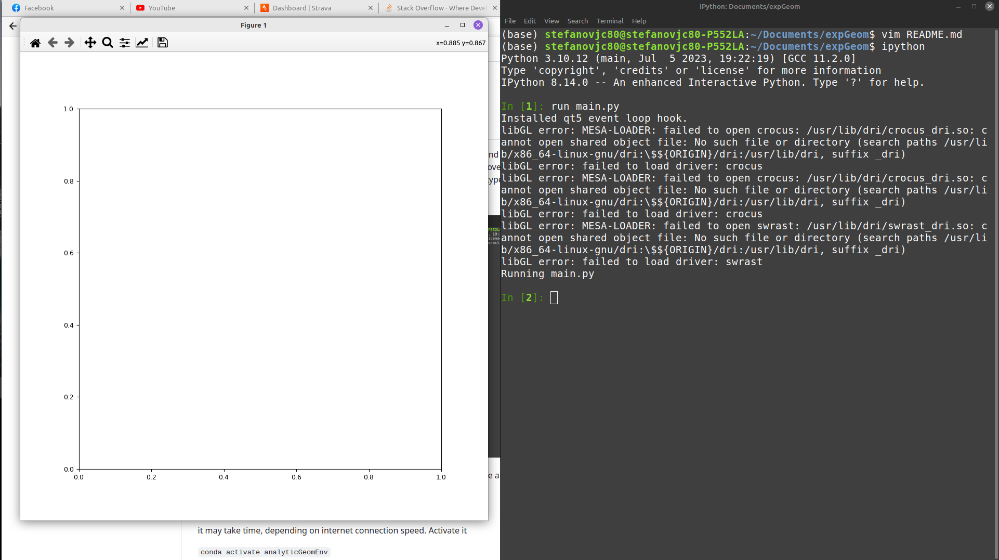
 

If everything works fine, than jump over this section. In case of any error message, due to any package version mismatch, than you need to create a 'analyticGeomEnv' conda environment. So, go back to your OS console, on the "analyticGeometry" folder and type

`conda env create -f analyticGeomEnv.yml`

`conda activate analyticGeomEnv`.

(it may take time, depending on the available connection speed). Once activated, try again to run main.py on your ipython interpreter, as previously explained.

# Usage

Say you want to draw a circumference, than you must type

`c1 = circumference()`

and a circumference into the plot window comes up

c1 is a python variable. More precisely, it's a circumference class type instance. Say you need a circumference centered in P(1, 2) with radius r = 4, than you get it by typing

`c1.center = point(1, 2)`

`c1.radius = 4`

in the some manner you can draw many other geometrical loci, each one of them being a class loaded with geompy. The 

`who`

command shows a list of all loaded classes 

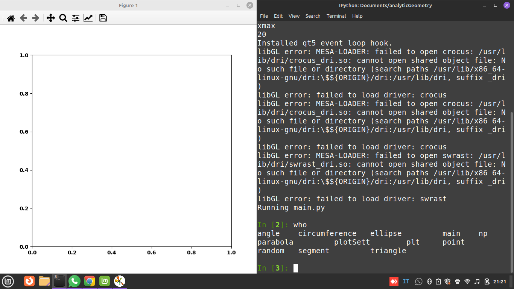

among them, the following classes 

### - [point](#draw-a-point)

### - [circumference](#draw-a-random-circumference)

### - [ellipse] (#draw-a-random-ellipse)

### - [segment](#draw-a-random-straight-line)

### - [parabola](#draw-a-random-parabola)

draw a specific geometric locus.

According with OOP programming, for each of them you can define one or more instances. Here, each instance is a specific geometrical locus.  

As an example

`c = circumference()`

generates a circumference type instance, labeled with "c" which draws a random circumference into the Cartesian Plane

typing

`c = name = "c"`

the "c" circumference is now named "c" on the Cartesian plane

Similarly, if you wish to create an additional circumference, or a different geometrical locus such as a point or a parabola, you would define the respective instance and you may name each one of them as follows

`c1 = circumference()`

`c1 = name = "c1"`

`P = point()`

`P.name = "P"`

`p = parabola()`

`p.name = "p"`

# Draw a point

By default, when no arguments are provided within the point parentheses, random coordinates are automatically assigned, otherwise you can pass them as point argument:

`A = point(3, -9)`

`A.name = "A"`

an alternative way to change coordinates is passing them into the .coords attribute as a python list of two numbers 

`P.coords = [3, -9]`

Furthermore, in order to draw a random point among the ones of the "c" geometrical locus, you can also pass "c" as point argument

`P = point(c)`

In the some manner, when no arguments are provided into the .draw() method, no label are assigned.

The .click("label") method, allows the user to manually select the point with the mouse. It has to be called two times: 

`P.click("P")`

`P.click("P")`

First time it provides a zoom of the area where the point need to be choosen, the second time it select exact position.

# Add axes and a grid

Choose one of the defined instances, no matter of which class they come from, and use the .grid() method

`P.grid()`

by typing it more times, you gonna increase grid density or dropped it down if -1 is passed as grid argument

`P.grid(-1)`

otherwise use the majorStep argument to set the desired "majorStep" size

`P.grid(majorStep = 2)`

optionally you can also set the wanted number of "minorSteps" to be included in each "majorStep

`P.grid(majorStep = 2, minorSteps = 20)`

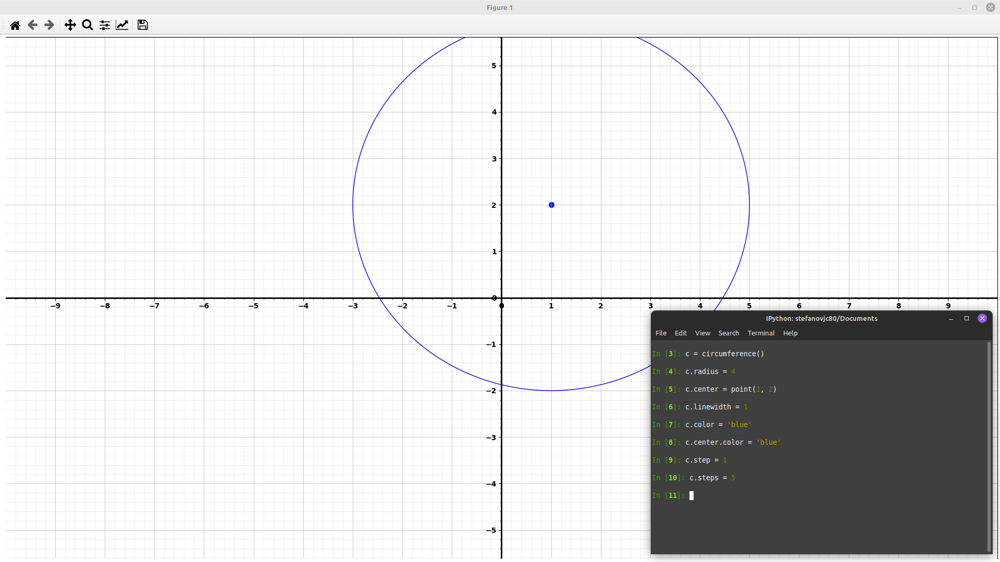

# Change geometrical loci parameters

When you create a Python instance like c = circumference(), it becomes a versatile object with various attributes, methods, and even instances of different classes. For instance, in the previous case of a circumference type instance, there is a point class instance in it, which is the center of the circumference. 

You can explore these attributes and methods by simply typing

`print(c)`

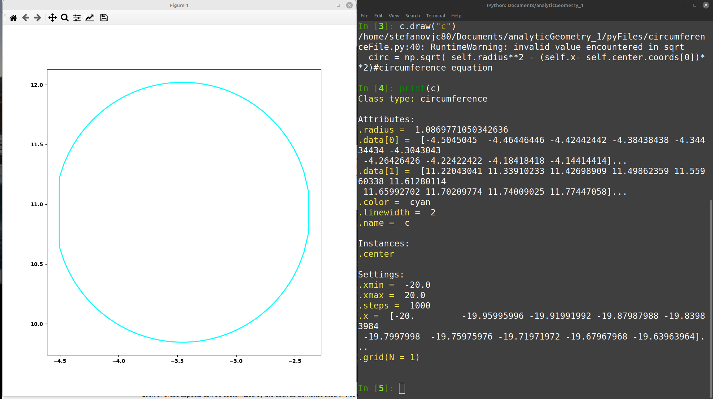

Each of these aspects can be customized by the user, as demonstrated in this example:

`c.radius = 7`

`c.color = 'blue'`

`c.center = point(0, 0)`

where, according with matplotlib library, the .color attribute can be choosen from the following list

- ``'b'``          blue

- ``'g'``          green

- ``'r'``          red

- ``'c'``          cyan

- ``'m'``          magenta

- ``'y'``          yellow

- ``'k'``          black

- ``'w'``          white

# Draw a (random) segment

`l1 = line()`

l1 is an object of "line" class type. Two random points are generated and a segment passing through is drawn.

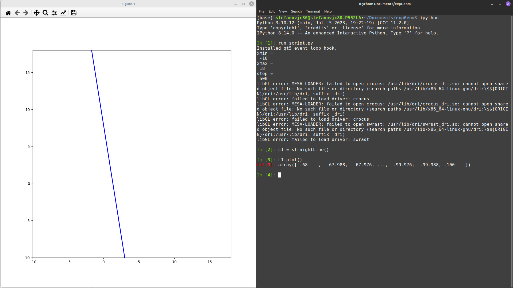

## Draw a specific straight line

**Draw a line from angular coefficient and intercept**

First of all delete all speciments of s1 instance

`l1.erase()`

`l1.angCoeff = 1`

`l1.intercept = 10`

`l1.name = "l1"`

**Draw a line passing through two different point: A and B respectively**

`A = point(3, 6)`

`B = point(-2, 1)`

`l1.erase()`

`l1.point[0] = A

`l1.point[1] = B`

`l1.draw("s1")`

Otherwise 

`l1.cut`

in case you need a segment in between A and B

**Draw a line passing through one point, say point A, and having a specific angular coefficient**

`A = point(3, 6)`

`s1.erase()`

`s1.point[0] = A

`s1.angCoeff = -1

`s1.name = "s1"`

**Draw a line passing through one point, say point A, and having a specific y-intercept**

`A = point(3, 6)`

`l1.erase()`

`l1.point[0] = A

`l1.intercept = -1

`l1.name = "s1"`

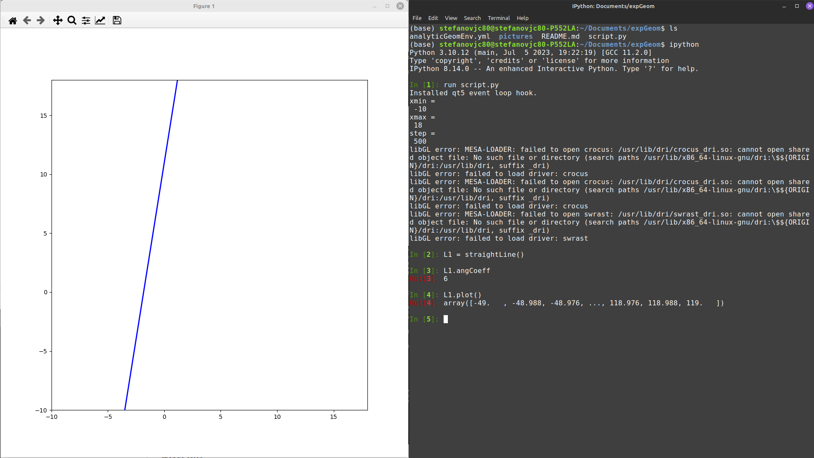

# Draw a (random) circumference

As a further example, say you want to draw a circumference.
Firstly define a circumference type instance which I suggest you to call 'C1' as follows

`C1 = circumference()`

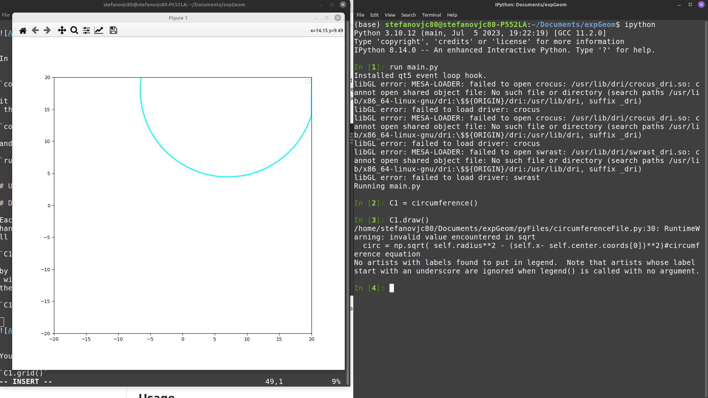

by typing 

Now you want to see detalils of "C1" instance. By typing

`print(C1)`

all C1 details are available

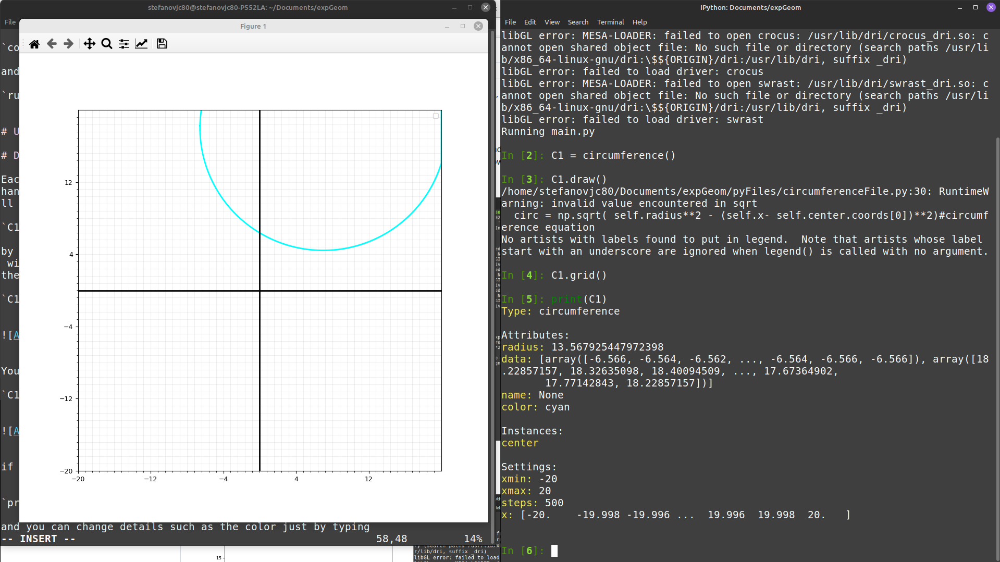

here how to change its attributes

`C1.color = 'red'`

or simply

`C1.color = 'r'`

Once the attribute is going to be changed, than use again the "draw" method

`C1.name = "C1"`

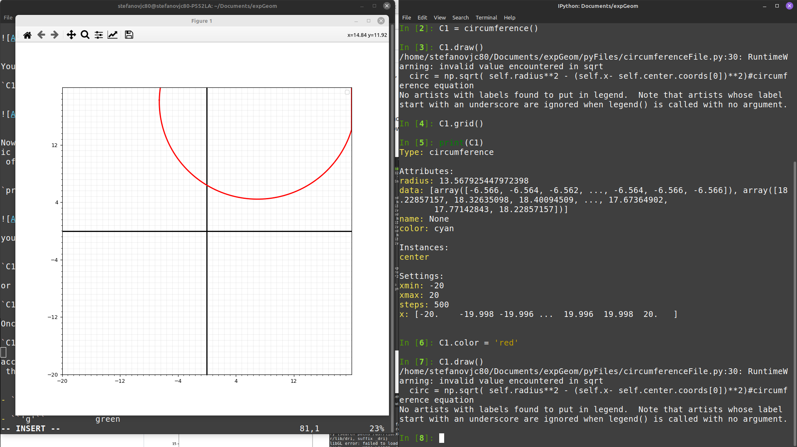

## Draw a specific circumference

In the some way you can change the radius size or you can add a name 

`C1.radius = 4`

`C1.name = "first circumference"`

"center" is an instance of point class which is conteined into C1 instance. This means that typing

`print(C1.center)`

You gonna have a list of all Attributes, methods and settings related to the C1.center instance

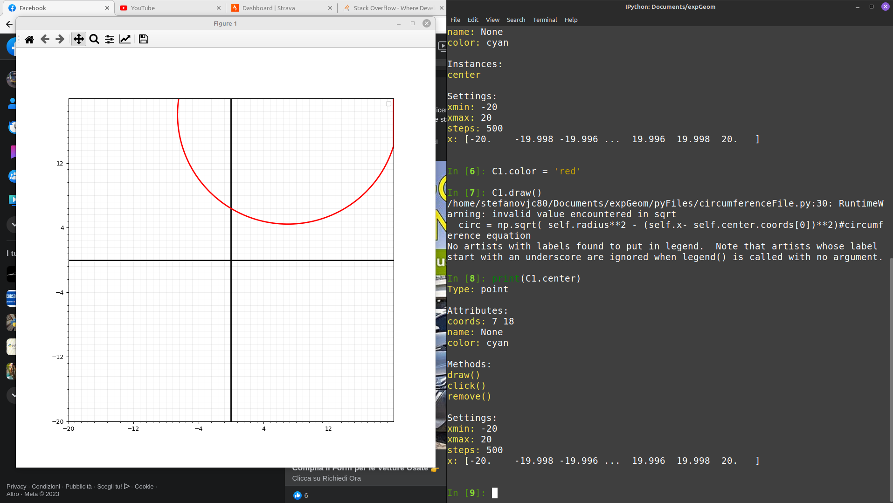

you can change the center coordinates by typing

`C1.center.coords = [2, 5]`

`C1.name = "C1"`

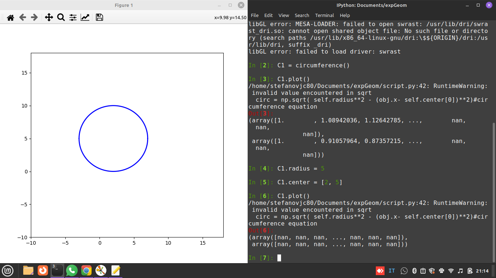

# Change color

Say you have drawn a circumference by using a "circunference method" named "C1". To change it's color to red type this

`C1.color = "red"`

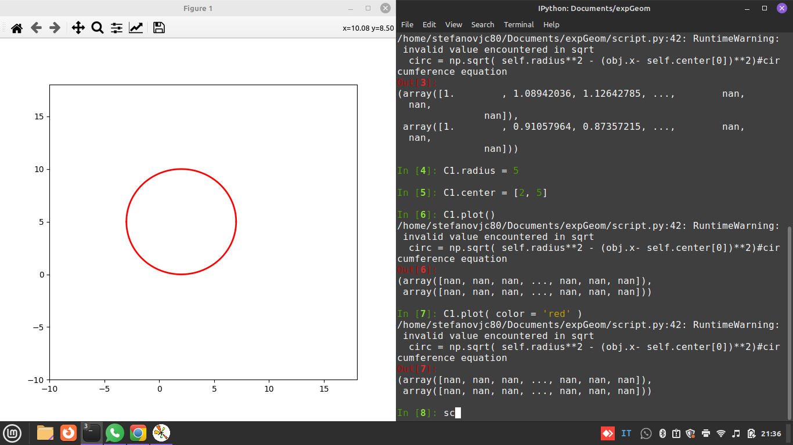

to change to "black" type

`C1.color = 'black'`

# Draw a (random) Parabola

`p1 = parabola()`

p1 is an object of "parabola" class type which choose random values for the parabola parameters:

- x-shift (p1.xShift)

- y-shift (p1.yShift)

- concavity (p1.concavity)

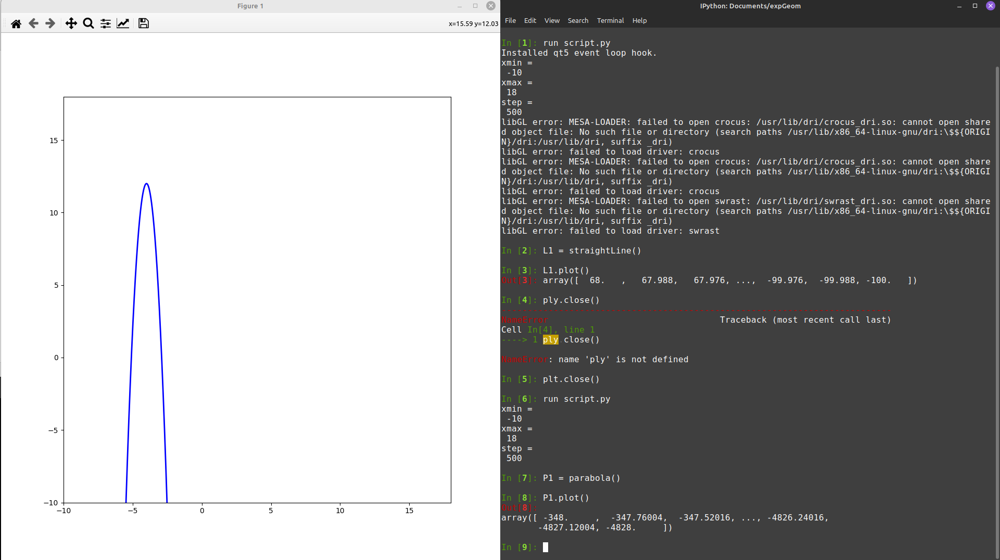

## Draw a specific parabola

choose an x-Shift of 

`p1.xShift = 5`

choose a y-Shift of 0

`p1.YShift = 0`

choose a concavity equal to 0.5

`p1.concavity = 0.5`

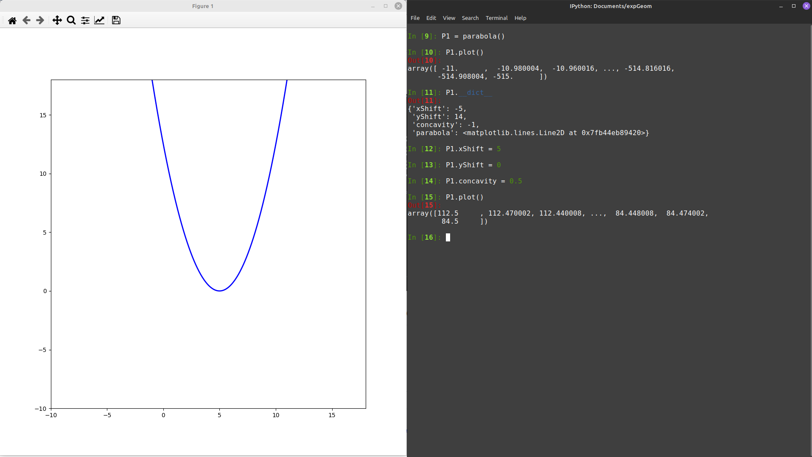
