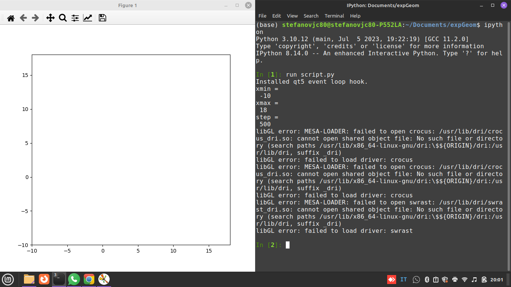
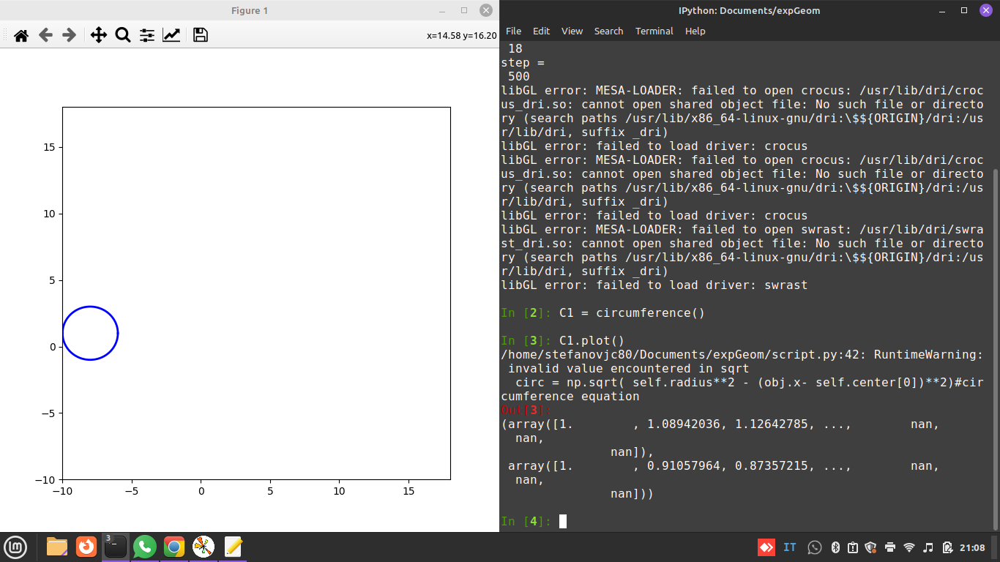

The present project is thought to be a python tool to be used by high school students dealing with analytical geometry. It's already plenty of software which shows geometrical shapes, but in this case the student has to manage a python interpreter which I believe it's an opportunity to start managing computer programming issues.

<b> Installation </b>

Just ensure you have a fully working python environment with matplotlib and numpy installed on it. 

# Usage

Once you have it, than you can simply download the script.py file and run it on a python interpreter with the following command:

`run script.py`

at this stage the interpreter will ask you to choice the size of a Cartesian Plane. Say you want a Cartesian Plane with both axes ranging from -10 to 18, with 500 steps.

Than you can plot one of the following geometric places

### - Circomference

### - Straight Line

###- Parabola

## Random circumference

`C1 = circumference()`

`C1.plot()`

# Circumference with specific center position and radius size

`C1.radius = 5`

to change the radius to 5

`C1.center = [2, 5]`

to move the center to the point [2, 5]. 

`C1.plot()`

To modify the plot

change color

`C1.plot( color = 'red')`

`

In case you want to draw a straight line or a parabola, than do the some job with one of the following classes:

`L1 = straightLine()`

`L1.plot()`

for a straight line

`P1 = parabola()`

`P1.plot()`

for a parabola

clearly, straight lines or parabola do not have any radius or center. If you want to modify their position on the Cartesian Plane or their shape, than type

`P1.__dict__`

or

`L1.__dict__`

once replaced the random attributes chosen from the software, than plot again

`P1.plot()`

or

`L1.plot()`
